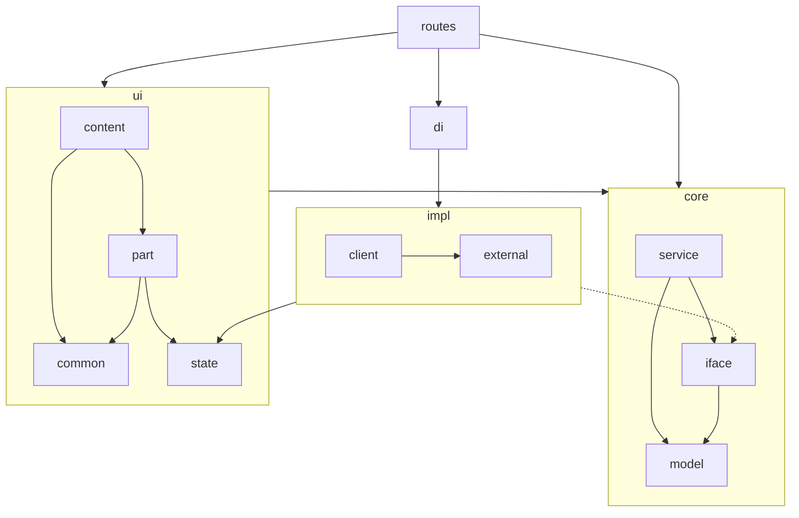

```mermaid
graph TB
    routes --> ui
    routes --> core
    routes --> di
    di --> impl

    subgraph core
        direction LR
        service --> iface
        service --> model
        iface --> model
    end
    
    subgraph ui
        direction LR
        content --> part
        content --> common
        part --> common
        part --> state
    end

    subgraph impl
        direction LR
        client --> external
    end

    ui --> core

    impl --> state
    impl -.-> iface
```
